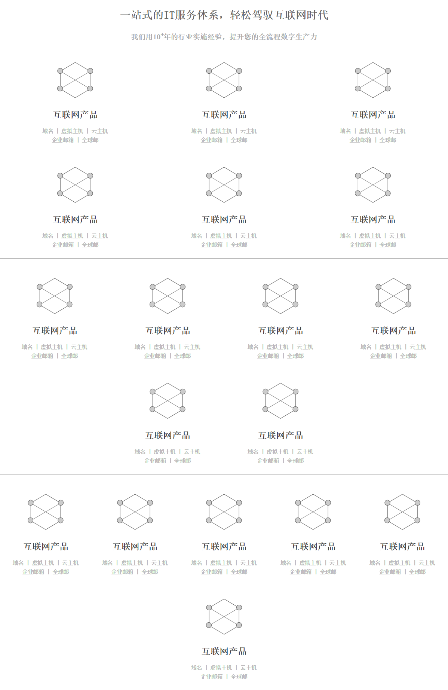
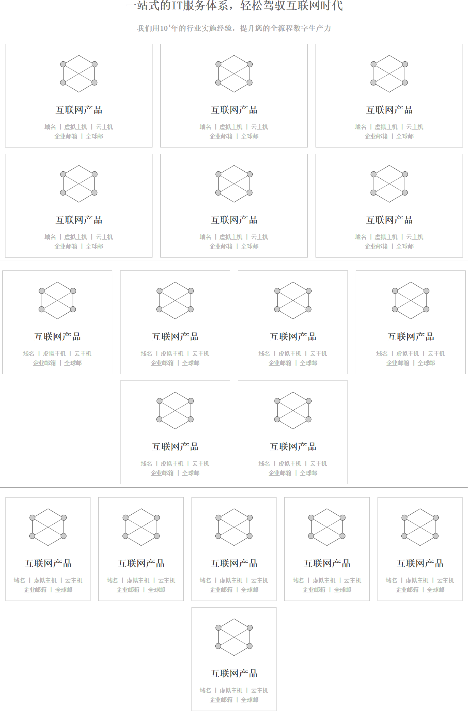

# ufnc

一个楼层套件。

## CSS Class

* .ufnc  组件容器
* .ufnc-row  卡片行
* .ufnc-row.cols-3  每行3个盒子
* .ufnc-row.cols-4  每行4个盒子
* .ufnc-row.cols-5  每行5个盒子
* .ufnc-row.border  盒子有边框
* .ufnc-box  盒子
* .ufnc-h1  组件的标题
* .ufnc-h2  组件的副标题
* .ufnc-h3  盒子的标题
* .ufnc-h4  盒子的副标题
* .ufnc-text 盒子的文字
* .ufnc-icon  盒子的icon

## 层次关系：

```
.ufnc
    .ufnc-h1
    .ufnc-h2
    .ufnc-row.cols-3
        .ufnc-box
            .ufnc-icon
            .ufnc-h3
            .ufnc-h4
        .ufnc-box
        .ufnc-box
        .ufnc-box
```

## 示例

> 示例中间的横线是100%宽度参考线

示例一：盒子无边框



示例二：盒子有边框


